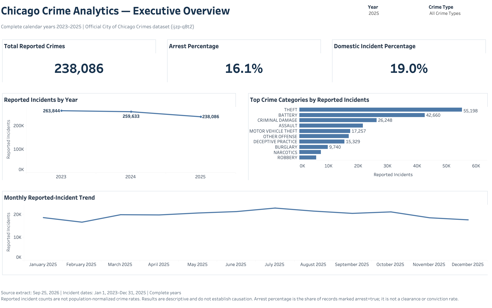
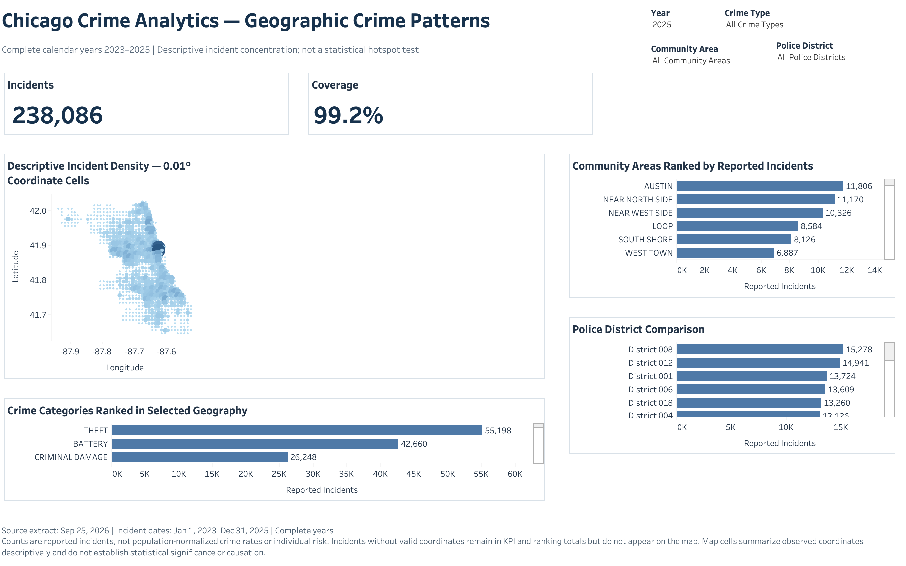
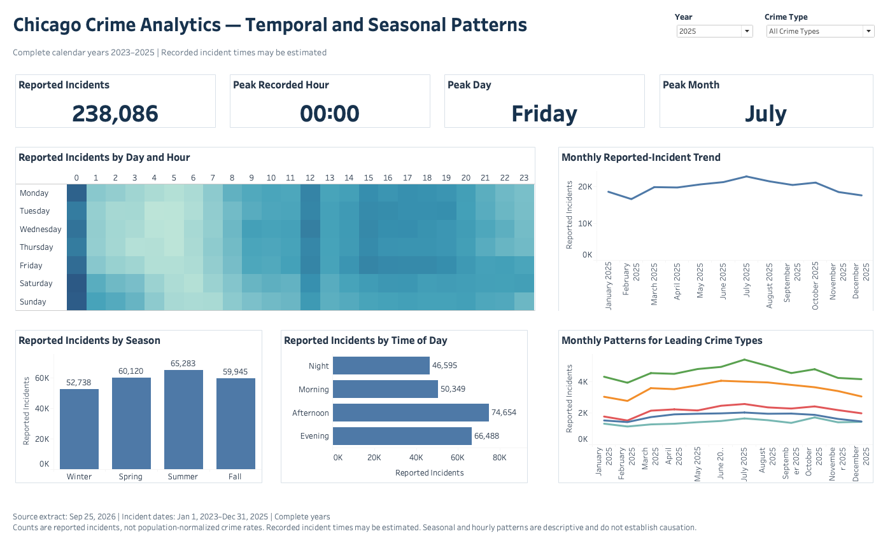

# Chicago Crime Analytics

An end-to-end data analytics and business intelligence portfolio project built from official City of Chicago reported-crime data. The project uses reproducible PostgreSQL, SQL, and Python workflows to examine temporal, geographic, seasonal, crime-category, domestic-incident, and arrest patterns. The acquired source extract contains 761,563 records across the three complete calendar years 2023–2025. Executive Overview Page 1, Geographic Crime Patterns Page 2, and Temporal and Seasonal Patterns Page 3 are validated in Tableau Desktop. Page 4 and evidence-backed resource-planning recommendations remain planned.

## Project objective

The objective is to produce an auditable analysis of reported crime patterns in Chicago while keeping metric definitions consistent across SQL, Python, Tableau, and project documentation. The project calculates verified citywide and eligible community-area year-over-year changes using complete calendar years, distinguishes incident counts from population-normalized rates, and avoids causal claims from observational data.

## Official dataset source

The primary source is the City of Chicago Data Portal's [Crimes - 2001 to Present](https://data.cityofchicago.org/Public-Safety/Crimes-2001-to-Present/ijzp-q8t2/data) dataset (dataset identifier `ijzp-q8t2`), provided by the Chicago Police Department. The portal describes rows as reported crimes, except that murder records represent victims, and notes that records and classifications can change. On September 25, 2026, the project acquired source records with incident timestamps from January 1, 2023 through December 31, 2025. Partial-year 2026 records were excluded.

The eventual analysis must acknowledge that reported-crime data does not measure all crime, locations are approximate, coordinate and community-area fields may be missing, and administrative practices or later record updates may affect comparisons. Findings will describe associations and observed patterns, not causation.

## Technology stack

- PostgreSQL and SQL for storage, validation, transformation, and analytical queries
- Python, Pandas, and NumPy for reproducible analysis
- Matplotlib for static exploratory visualizations
- Tableau for the four-page interactive dashboard under staged implementation
- Git and GitHub for version control and portfolio delivery

## Analytical questions

The project is designed to answer:

1. How do reported incident counts change by year, month, season, day of week, and hour?
2. Which crime categories account for the largest counts and changes over time?
3. How are reported incidents distributed across Chicago community areas and coordinate-mappable locations?
4. Which eligible community areas show the largest verified full-year year-over-year changes?
5. What percentages of reported incidents are marked as arrest-related or domestic-related, and how do those percentages vary?
6. What operationally relevant patterns could inform resource-planning hypotheses without implying causation?

Population-normalized crime rates are outside the initial scope until an authoritative, year-aligned population source and rate methodology are added and documented. Counts must never be labeled as rates.

## Project architecture

```text
Official City source
        |
        v
data/raw (immutable, local, Git-ignored)
        |
        v
PostgreSQL staging -> data-quality assessment -> validated record-level clean table
        |                                      |
        v                                      v
Python QA and EDA                         Tableau extracts/dashboard
        |                                      |
        +------------------+-------------------+
                           v
              documented findings and metrics
```

The repository foundation, data pipeline, SQL/Python analysis, descriptive geographic analysis, and Tableau data preparation are complete. Executive Overview Page 1, Geographic Crime Patterns Page 2, and Temporal and Seasonal Patterns Page 3 have passed PostgreSQL benchmark, CSV, XML, source-reference, Tableau rendering, and filter-state validation. Page 4 and resource-planning recommendations remain planned.

## Repository structure

```text
.
├── README.md
├── .env.example
├── .gitignore
├── requirements.txt
├── data/
│   ├── raw/             # Immutable source files; contents ignored by Git
│   └── processed/       # Reproducible derived files; large exports ignored
├── docs/                # Plans, definitions, dictionary, and reports
├── images/              # Versionable documentation images
├── notebooks/           # Reproducible analysis notebooks
├── scripts/             # Acquisition, loading, validation, and analysis code
├── sql/                 # DDL, validation, transformation, and analysis SQL
└── tableau/             # Tableau workbook instructions and small artifacts
```

Empty working directories are retained with `.gitkeep` placeholders. Raw and large generated data exports remain local and are not committed; the small, reproducible Python figures are versioned for portfolio review.

## Milestone roadmap

| Milestone | Scope | Status |
|---|---|---|
| 0 | Repository foundation and analytical definitions | Complete |
| 1 | Source acquisition and raw-data integrity | Complete |
| 2 | PostgreSQL schema and reproducible load | Complete |
| 3 | Read-only data-quality assessment and proposed treatments | Complete |
| 4 | Data cleaning and feature engineering | Complete |
| 5 | Core SQL analysis and verified year-over-year metrics | Complete |
| 6 | Advanced SQL, reusable analytical views, and quantified portfolio findings | Complete |
| 7 | Python exploratory analysis and static visuals | Complete |
| 8 | Geographic and descriptive hotspot analysis | Complete |
| 9A | Tableau data preparation and dashboard specification | Complete |
| 9B | Four-page interactive Tableau workbook | In Progress |
| 9C | Geographic Crime Patterns dashboard | Complete |
| 9D | Temporal and Seasonal Patterns dashboard | Complete |
| 10 | Findings and resource-planning recommendations | Planned |
| 11 | Final QA, portfolio packaging, and resume metrics | Planned |

Detailed gates and acceptance criteria are in the [project plan](docs/project_plan.md). The executed extraction evidence is in [dataset acquisition](docs/dataset_acquisition.md), the PostgreSQL workflow and import validation are in [database setup](docs/database_setup.md), observed quality issues are in the [data-quality report](docs/data_quality_report.md), implemented record-level transformations are in the [cleaning report](docs/cleaning_report.md), and verified descriptive SQL findings are in the [core SQL analysis report](docs/sql_analysis_report.md). Independent Pandas validation, exploratory findings, and the visualization inventory are in the [Python EDA report](docs/python_eda_report.md); geographic methods and density limitations are in the [geographic analysis report](docs/geographic_analysis_report.md). Exact data sources, fields, calculations, filters, tooltips, sorting, interactions, and validation criteria are in the [Tableau dashboard plan](docs/tableau_dashboard_plan.md). Implemented Page 2 behavior is in the [Geographic Crime Patterns build guide](docs/tableau_page2_build_guide.md); Page 3 definitions and validation benchmarks are in the [Temporal and Seasonal Patterns build guide](docs/tableau_page3_build_guide.md). Claim-level calculations and candidate resume evidence are in [quantified findings](docs/quantified_findings.md). Metric formulas and comparison rules are in [metric definitions](docs/metric_definitions.md), and raw, clean, and analytical-view fields are described in the [data dictionary](docs/data_dictionary.md).

## Reproducibility overview

The workflow uses environment variables copied from `.env.example`, scripts and version-controlled SQL instead of manual transformations, immutable raw inputs, documented extraction metadata, and validation checks at each milestone. Paths in project code and documentation are repository-relative. Credentials, raw CSV files, database dumps, Tableau extracts, and other large generated exports are excluded from Git.

The acquisition is reproducible from a clean checkout after installing `requirements.txt`:

```bash
python3 scripts/download_crimes.py
```

The script applies the documented date filter, downloads 50,000-row pages using source-ID keyset pagination, orders records by `id ASC`, retries transient API failures, refuses to overwrite existing raw artifacts, and validates source counts before and after download. It writes an immutable Git-ignored CSV and JSON evidence manifest under `data/raw/`. See [dataset acquisition](docs/dataset_acquisition.md) for exact commands, filters, outputs, and limitations. The declared Python dependency set was installed successfully in a fresh repository-local virtual environment for Milestone 7 execution.

After creating a PostgreSQL database and configuring connection variables, the raw import is reproducible with:

```bash
python3 scripts/load_raw_postgres.py
```

The loader verifies the raw-file checksum and header, preserves parsed source fields in a text staging table, transactionally rebuilds the typed `raw_chicago_crimes` table, reconciles every row and field, and records a load audit. It rolls back the entire rebuild on any count, ID, cast, or reconciliation error. See [database setup](docs/database_setup.md) for database creation, schema, commands, and executed validation evidence.

The raw table can be profiled without modifying it by running:

```bash
psql -d chicago_crime -X -v ON_ERROR_STOP=1 -P pager=off \
  -f sql/02_data_quality.sql
```

The quality script runs inside a read-only transaction and reports duplicate identifiers, case-number repetition, date consistency, categorical quality, administrative-geography domains, coordinate coverage and plausibility, boolean distributions, field completeness, yearly coverage, and category cardinality. The subsequent clean-table implementation is documented separately below.

The clean table can be rebuilt and validated with:

```bash
psql -d chicago_crime -X -v ON_ERROR_STOP=1 \
  -f sql/03_data_cleaning.sql
```

The script transactionally recreates `clean_chicago_crimes` while leaving `raw_chicago_crimes` unchanged. It preserves source identifiers and crime categories, applies deterministic source-ID deduplication, validates administrative and coordinate geography, derives calendar/time features, creates targeted indexes, and aborts on row-lineage or feature-definition failures. Missing-coordinate incidents remain in the clean table for non-map analysis.

The 29-query core SQL analysis can be reproduced with:

```bash
psql -d chicago_crime -X -v ON_ERROR_STOP=1 \
  -f sql/04_business_analysis.sql
```

Each query documents its business question, metric, assumptions, and denominator. The suite covers dataset coverage, complete-year changes, categories and descriptions, month/day/hour/time-band patterns, weekday versus weekend, community areas, police districts, location descriptions, arrest and domestic indicators, seasonal patterns, and cross-query reconciliation. It executes inside a read-only transaction.

The advanced analytical views, rankings, rolling averages, quantified findings, and fail-fast source reconciliation can be reproduced with:

```bash
psql -d chicago_crime -X -v ON_ERROR_STOP=1 -P pager=off \
  -f sql/05_advanced_analysis.sql
```

The script uses an official 77-area City lookup, calculates citywide and community-area year-over-year changes, applies a documented 500-incident prior-year threshold only to percentage ranks, and preserves all 77 areas in absolute-change ranks. It creates reusable views for executive KPIs, yearly trends, community-area changes, crime-type trends, monthly/rolling patterns, and coordinate-eligible map records. Non-geocoded incidents remain in the canonical clean table and all applicable non-map analyses.

The Python notebooks and eight static figures can be rebuilt and executed with:

```bash
python scripts/build_notebooks.py
jupyter nbconvert --to notebook --execute --inplace \
  --ExecutePreprocessor.timeout=600 notebooks/01_data_validation.ipynb
jupyter nbconvert --to notebook --execute --inplace \
  --ExecutePreprocessor.timeout=600 notebooks/02_exploratory_analysis.ipynb
```

The notebooks locate the repository dynamically, read PostgreSQL settings from environment variables or a Git-ignored `.env`, force database transactions to read-only mode, and do not print credentials or machine-specific paths. The validation notebook independently reconstructs annual and all 154 community-area comparisons from record-level data; the exploratory notebook covers yearly, monthly, seasonal, weekday, hourly, category, arrest, domestic, and community-area patterns.

The geographic notebook and its compact Tableau-ready derived data can be reproduced with:

```bash
python scripts/build_geographic_notebook.py
jupyter nbconvert --to notebook --execute --inplace \
  --ExecutePreprocessor.timeout=900 notebooks/03_geographic_analysis.ipynb
```

The notebook validates community-area and coordinate coverage, analyzes community and district volume, category concentration, annual geographic change, persistence, location-time profiles, and coordinate density, then writes five derived CSVs under Git-ignored `data/processed/tableau_geographic/`. Coordinate density is explicitly descriptive; no formal spatial-significance test or population-normalized rate is claimed.

The validated Tableau presentation layer can be rebuilt with:

```bash
psql -d chicago_crime -X -v ON_ERROR_STOP=1 -P pager=off \
  -f sql/06_tableau_preparation.sql
```

The SQL creates ten page-oriented aggregate views and fails before commit if executive, geographic, temporal, category, arrest, domestic, month/category, or coordinate-density totals do not reconcile. Optional portable CSV extracts can then be generated with:

```bash
python scripts/export_tableau_data.py
```

Generate only the two Executive Overview sources with:

```bash
python scripts/export_tableau_data.py --profile page1
```

Create and validate the filterable geographic presentation view, then export its Page 2 source with:

```bash
psql -d chicago_crime -X -v ON_ERROR_STOP=1 -P pager=off \
  -f sql/08_tableau_geographic_page.sql
python scripts/export_tableau_data.py --profile page2
```

Prepare the two independent import-ready Page 3 temporal sources with:

```bash
psql --no-psqlrc --dbname "${PGDATABASE:-chicago_crime}" \
  -v ON_ERROR_STOP=1 -P pager=off \
  --file sql/10_tableau_temporal_page.sql
psql --no-psqlrc --dbname "${PGDATABASE:-chicago_crime}" \
  -v ON_ERROR_STOP=1 -P pager=off \
  --file sql/11_tableau_page3_validation.sql
./.venv/bin/python scripts/export_tableau_data.py --profile page3
```

Generate and structurally validate the implemented Pages 1–3 workbook with:

```bash
python scripts/generate_tableau_workbook.py
```

The exporter uses a read-only environment-configured connection, deterministic ordering, CSV row-count reconciliation, and local checksum manifests under Git-ignored `data/processed/tableau/`. Page 1 uses independent year/category and month/category sources; Page 2 uses one 50,037-row geographic source; and Page 3 uses an 87,809-row additive detail source plus a 96-row year/crime-type KPI source. The KPI source prevents peak-card results from depending on Tableau table-calculation addressing; it is not joined to the detail source. The generator writes 21 worksheets, three fixed-size dashboards, five CSV-backed data sources, and shared workbook parameters. See the [Tableau dashboard plan](docs/tableau_dashboard_plan.md), [Executive Overview build guide](docs/tableau_page1_build_guide.md), [Geographic Crime Patterns build guide](docs/tableau_page2_build_guide.md), and [Temporal and Seasonal Patterns build guide](docs/tableau_page3_build_guide.md).

## Current status

**Status: Milestones 9A, 9C, and 9D complete; Milestone 9B remains in progress.** The workbook contains 21 worksheets and three validated dashboards. Page 3's detail and KPI CSVs reconcile to PostgreSQL, and the workbook passes XML, source-reference, Tableau rendering, and filter-state validation. The retained [2025 All Crime Types](images/tableau/temporal_seasonal_patterns_2025_all.png) and [2025 THEFT](images/tableau/temporal_seasonal_patterns_2025_theft.png) screenshots verify the corrected KPI cards and four time-of-day bars. Page 4 remains planned.

### Executive Overview preview



The corresponding [2025 Theft validation view](images/tableau/executive_overview_2025_theft.png) confirms synchronized category filtering across the KPIs and trends.

### Geographic Crime Patterns preview



The corresponding [2025 Theft validation view](images/tableau/geographic_crime_patterns_2025_theft.png) confirms synchronized category filtering across the incident KPI, coverage KPI, descriptive coordinate map, community-area ranking, district comparison, and geographic category analysis.

### Temporal and Seasonal Patterns preview



The corresponding [2025 Theft validation view](images/tableau/temporal_seasonal_patterns_2025_theft.png) confirms synchronized filtering across the temporal KPIs, weekday-hour heatmap, monthly trend, seasonal comparison, time-of-day distribution, and category trend.
