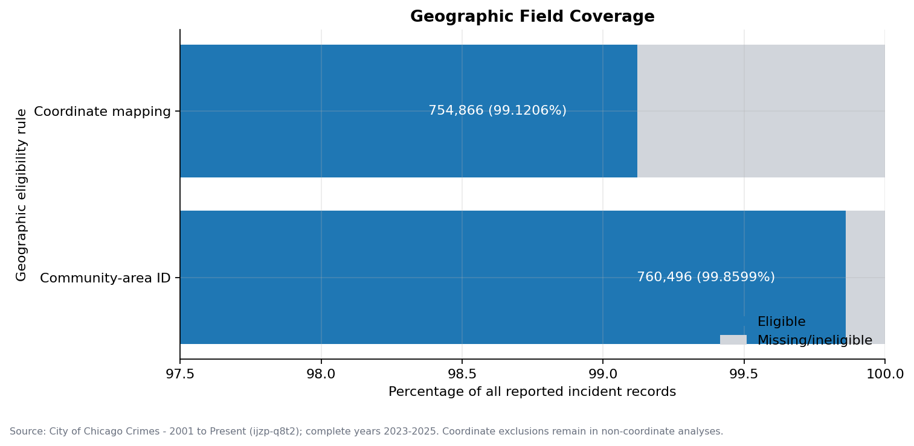
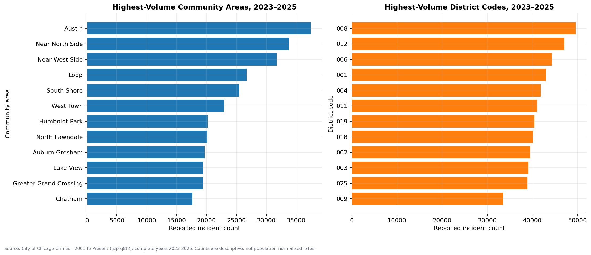
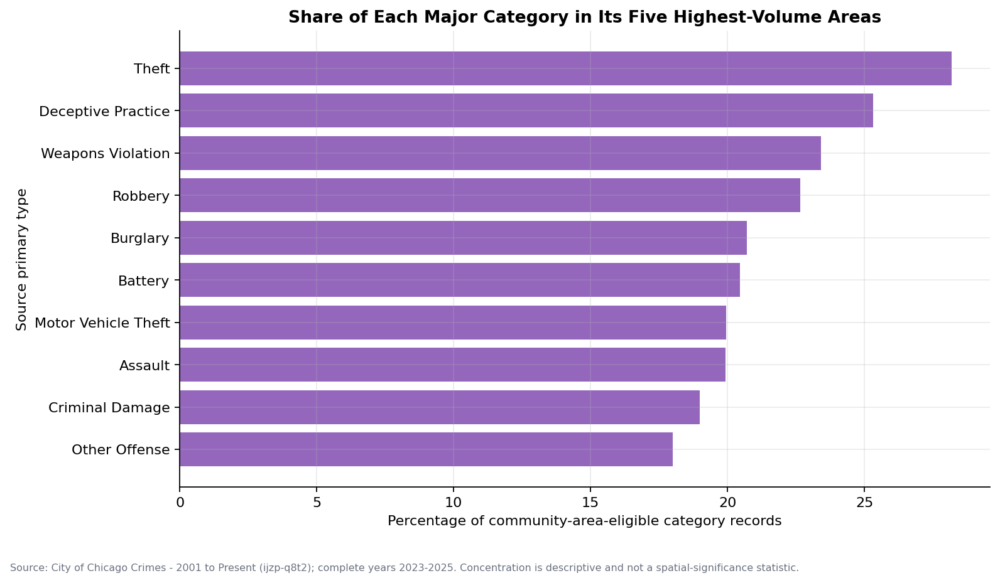
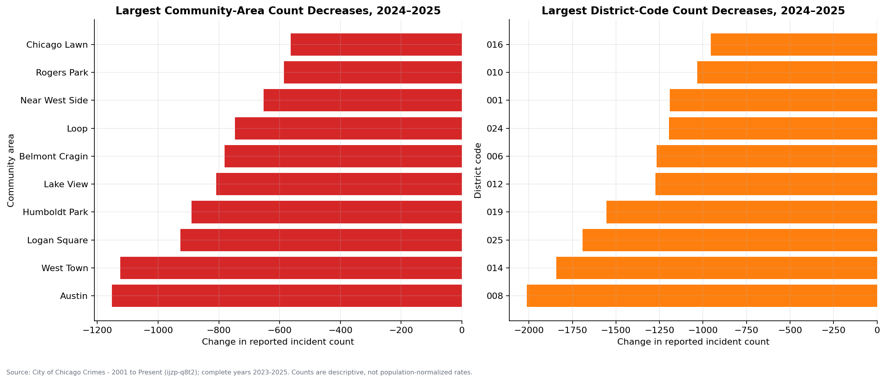
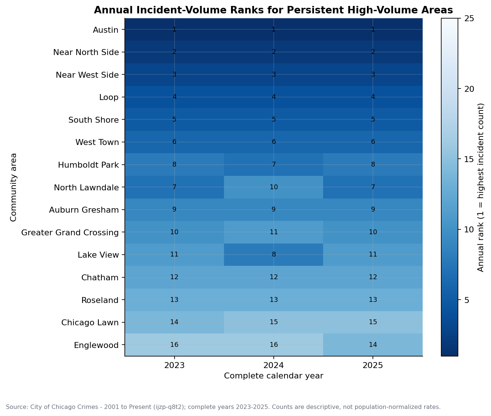
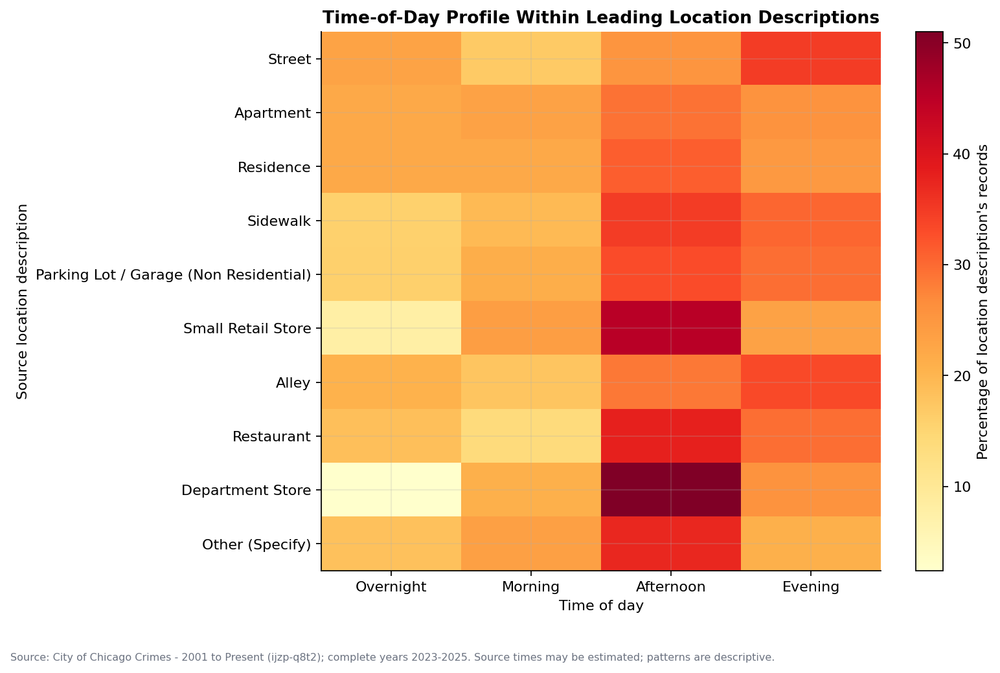
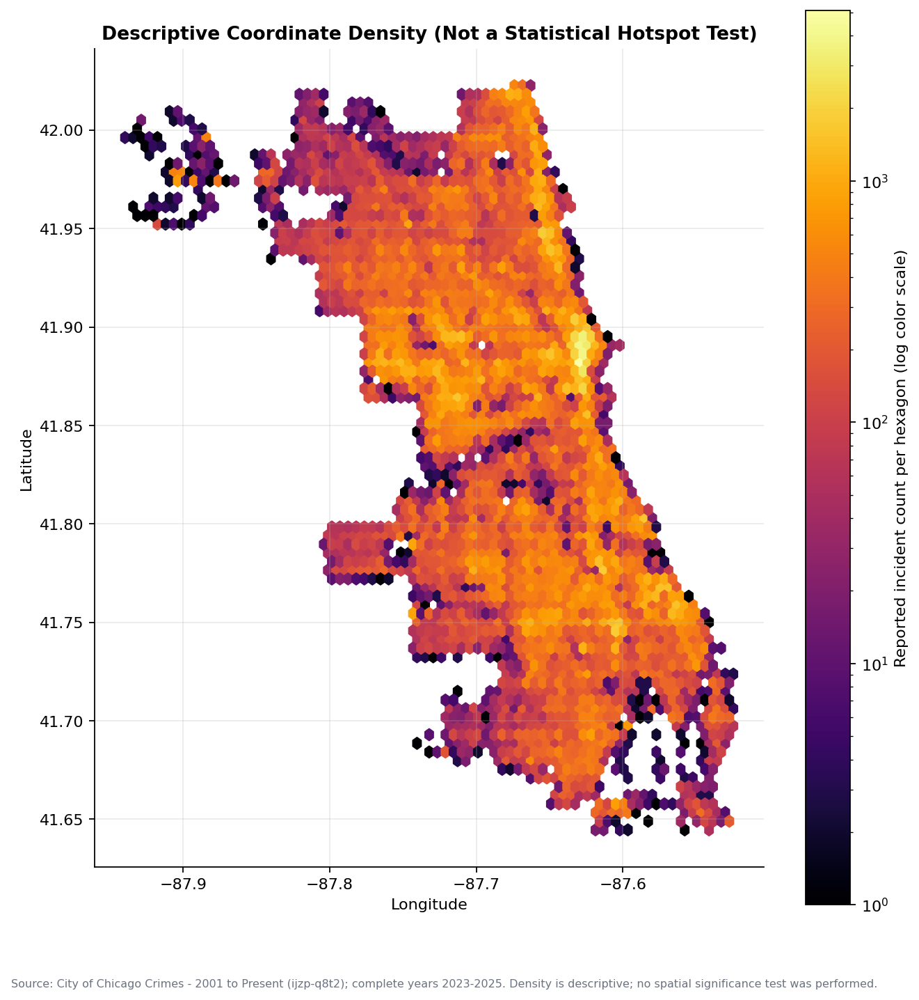

# Geographic and Hotspot Analysis Report

## Scope and execution status

Milestone 8 analyzed geographic patterns in 761,563 official Chicago reported-incident records dated January 1, 2023 through December 31, 2025. [`03_geographic_analysis.ipynb`](../notebooks/03_geographic_analysis.ipynb) was restarted and executed from beginning to end on September 26, 2026. All 15 code cells completed sequentially with zero errors, all 14 geographic validation checks passed, and seven source-attributed Matplotlib figures were generated.

The notebook used Pandas 2.3.3, NumPy 2.0.2, Matplotlib 3.9.4, and a read-only PostgreSQL connection configured through environment variables or a Git-ignored `.env`. Credentials, connection URLs, and machine-specific paths are not stored in the notebook.

## Methodology and interpretation rules

Three geographic scopes are deliberately separated:

1. **All clean records:** 761,563 records are retained for citywide and district-code analysis.
2. **Community-area eligible:** 760,496 records have a valid source community-area ID from 1 through 77 and are eligible for named community-area analysis.
3. **Coordinate-mappable:** 754,866 records contain a coordinate pair that passed the documented availability, global validity, non-zero, and City-envelope checks. Only these records are eligible for coordinate-density displays.

Community-area names come from the official lookup in `vw_community_area_lookup`. Source community-area identifiers determine membership; coordinates are not used to impute missing administrative geography. District codes use the cleaned source-derived field and `district_current_flag`; code `061` is retained and labeled as unmatched to the current reference rather than silently removed.

All administrative-area results are reported incident volumes. They are not population-normalized rates and do not measure individual risk. The coordinate figure is a descriptive density surface. No Getis-Ord Gi*, Moran's I, spatial scan statistic, confidence interval, or other formal spatial significance method was performed, so no result is called a statistically significant hotspot.

## Geographic coverage

| Geographic measure | Eligible records | Missing/ineligible | Coverage |
|---|---:|---:|---:|
| Valid community-area ID | 760,496 | 1,067 | 99.8599% |
| Coordinate mapping | 754,866 | 6,697 | 99.1206% |

Missing coordinates are excluded only from coordinate-level displays. Those 6,697 records remain available for community, district, category, temporal, arrest, domestic, and other non-coordinate analyses when their required fields are present.

## Community-area and district incident volume

### Leading community areas

| Rank | Community area | Reported incidents | Share of eligible-area records |
|---:|---|---:|---:|
| 1 | Austin | 37,464 | 4.9263% |
| 2 | Near North Side | 33,810 | 4.4458% |
| 3 | Near West Side | 31,729 | 4.1721% |
| 4 | Loop | 26,725 | 3.5142% |
| 5 | South Shore | 25,447 | 3.3461% |

### Leading district codes

| Rank | District | Reported incidents | Share of all records |
|---:|---:|---:|---:|
| 1 | 008 | 49,610 | 6.5142% |
| 2 | 012 | 47,142 | 6.1902% |
| 3 | 006 | 44,341 | 5.8224% |
| 4 | 001 | 43,013 | 5.6480% |
| 5 | 004 | 41,894 | 5.5011% |

The dataset contains 24 observed district codes. District `061` accounts for 1,020 records and remains flagged as unmatched to the current official reference. District `031` is current-reference eligible but contains only 49 records in the selected extract. These are source-domain observations, not judgments about validity or service demand.

## Crime-category geographic concentration

For each of the ten highest-volume source primary types, the notebook calculated the share of community-area-eligible category records appearing in its five highest-volume areas. This is a descriptive concentration measure, not a spatial-significance statistic.

| Primary type | Leading area | Leading-area share | Top-five-area share |
|---|---|---:|---:|
| Theft | Near North Side | 7.7473% | 28.1744% |
| Deceptive Practice | Near North Side | 7.4759% | 25.3156% |
| Weapons Violation | Austin | 6.4450% | 23.4230% |
| Robbery | Austin | 6.5386% | 22.6462% |
| Burglary | West Town | 5.2121% | 20.7043% |
| Battery | Austin | 6.0356% | 20.4513% |
| Motor Vehicle Theft | Austin | 4.7012% | 19.9601% |
| Assault | Austin | 5.5363% | 19.9374% |
| Criminal Damage | Austin | 4.7717% | 18.9974% |
| Other Offense | Austin | 5.2150% | 17.9920% |

Theft was the most concentrated of these categories under the top-five-area measure. This does not imply that residents or visitors in those areas faced the highest individual risk; no population, foot-traffic, land-use, or other exposure denominator was introduced.

## Annual geographic changes

The largest community-area absolute decline from 2024 to 2025 remained Austin: 12,958 to 11,806, a decrease of 1,152 records (-8.8903%). West Town followed with a decrease of 1,124 records (-14.0307%). These independently calculated values reconciled exactly to `vw_community_area_yoy`.

At the district-code level, the largest absolute decreases were:

| District | 2024 | 2025 | Absolute change | Percentage change |
|---:|---:|---:|---:|---:|
| 008 | 17,289 | 15,278 | -2,011 | -11.6317% |
| 014 | 9,902 | 8,060 | -1,842 | -18.6023% |
| 025 | 13,287 | 11,596 | -1,691 | -12.7267% |
| 019 | 14,132 | 12,577 | -1,555 | -11.0034% |
| 012 | 16,215 | 14,941 | -1,274 | -7.8569% |

District comparisons are counts tied to observed source codes, not district crime rates or workload prescriptions.

## Persistent high-volume areas

Austin, Near North Side, Near West Side, Loop, South Shore, and West Town held ranks 1 through 6, respectively, in every complete year. Humboldt Park, North Lawndale, and Auburn Gresham also remained within the ten highest-volume areas in all three years. Persistence describes repeated count rank only and does not establish population-normalized risk or a causal geographic effect.

## Location-specific temporal patterns

Within the ten leading source location descriptions, Street and Alley records were most concentrated in the Evening band, at 34.7047% and 33.1682% of their respective totals. The other eight leading descriptions peaked in the Afternoon. Department Store had the strongest single-band concentration: 51.0041% of its 15,536 records were assigned to Afternoon. Small Retail Store followed at 45.2244% of 26,070 records in Afternoon.

These results use the source-derived four-band time definition. Incident times may be estimated, and location descriptions are categorical rather than precise places, so the patterns are not causal or predictive.

## Coordinate-level descriptive density

The coordinate analysis used all 754,866 map-eligible records. The figure applies a 75-column Matplotlib hexagonal display grid with logarithmic color normalization. A separate Tableau-ready aggregation floors latitude and longitude to 0.01-degree cells—approximately 0.8 to 1.1 kilometers across Chicago—and stores the cell center by year. This latitude/longitude grid is not equal-area, and results depend on the selected resolution.

The plotted concentrations are called **descriptive incident-density concentrations**, not statistically significant hotspots. No inference is made about individual risk, underlying population, exposure, enforcement activity, or causal conditions.

## Tableau-ready geographic outputs

The notebook generated five compact, reproducible CSV files under the Git-ignored `data/processed/tableau_geographic/` directory. They are not committed because they are derived data exports.

| Local output | Grain | Rows | Purpose |
|---|---|---:|---|
| `community_area_year.csv` | Community area × year | 231 | Counts, shares, annual ranks, and adjacent-year changes |
| `district_year.csv` | District code × year | 72 | Counts, reference status, shares, ranks, and changes |
| `community_area_category_year.csv` | Area × category × year | 5,395 | Category composition within area-year |
| `coordinate_density_grid.csv` | Year × 0.01-degree display cell | 2,127 | Compact descriptive coordinate-density layer |
| `location_time_of_day.csv` | Leading location description × time band | 40 | Location-specific temporal profiles |

The existing `vw_geographic_crime_points` view remains the Tableau-ready record-level point layer with 754,866 rows. Tableau itself was not opened and no dashboard was built in this milestone.

## Validation evidence

All 14 notebook validation checks passed:

- The Pandas record count and unique source-ID count both equaled 761,563.
- Coordinate-mappable count matched both `vw_executive_kpis` and `vw_geographic_crime_points` at 754,866.
- Coordinate exclusions equaled 6,697.
- Community-area eligibility matched `vw_executive_kpis` at 760,496.
- All 77 Pandas community-area totals matched direct SQL aggregation with a maximum difference of zero.
- Community-area totals summed to the eligible denominator; district totals summed to the full dataset.
- All 154 adjacent-year community-area values matched `vw_community_area_yoy` within `1e-10`; the maximum observed difference was zero.
- Major-category area totals, selected-location time totals, and coordinate-grid totals reconciled to their respective source scopes.
- All five Tableau-ready exports were created with non-zero row counts.
- All seven expected geographic figures were created and visually inspected.

## Limitations

- Reported-crime data does not measure all crime and can be revised after extraction.
- Murder records represent victims according to the source, so rows and cases differ conceptually.
- Administrative-area counts are not population- or exposure-normalized rates.
- A location's observed record count does not measure individual risk.
- Coordinates are approximate; 6,697 records are unavailable for point-density analysis.
- The display grid is resolution-dependent and not equal-area.
- No formal spatial significance, spatial autocorrelation, or cluster test was performed.
- District reference status does not prove that unmatched source codes are invalid.
- Incident timestamps may be estimated.
- The analysis is descriptive and does not establish causation.
