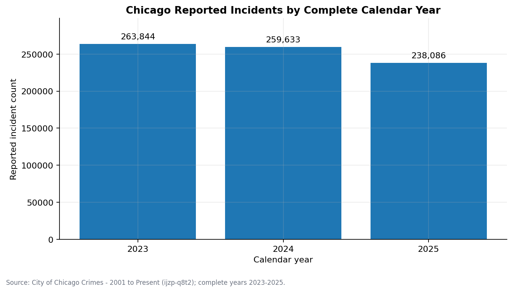
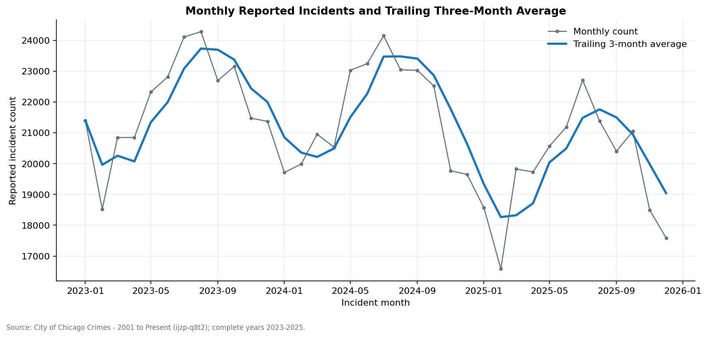
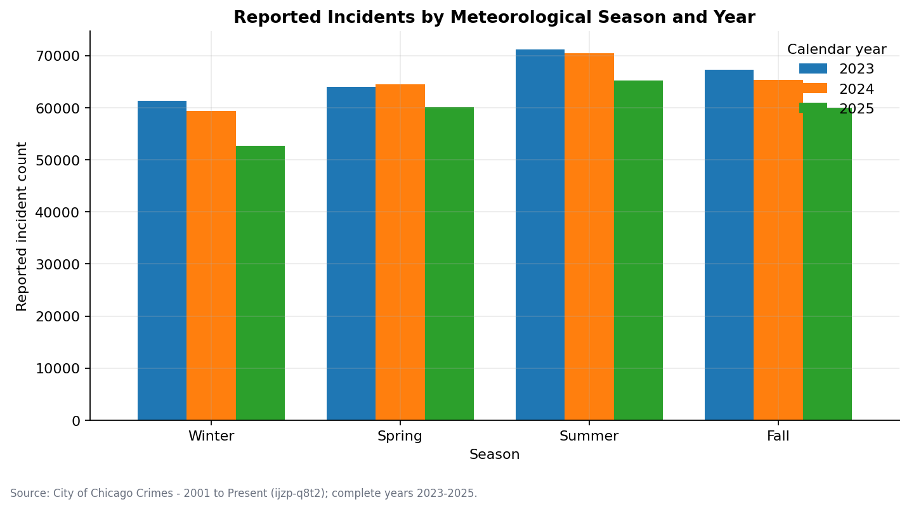
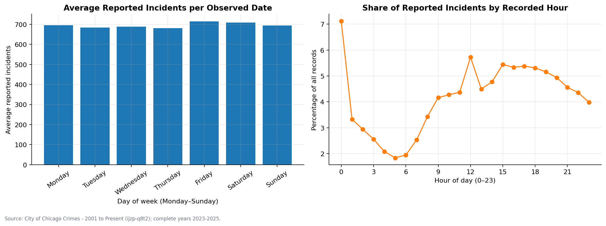
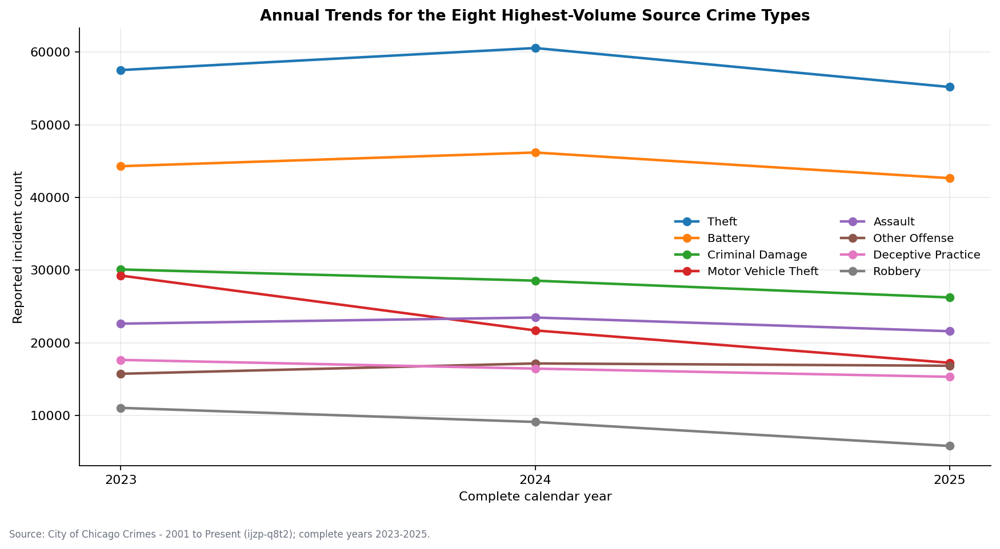
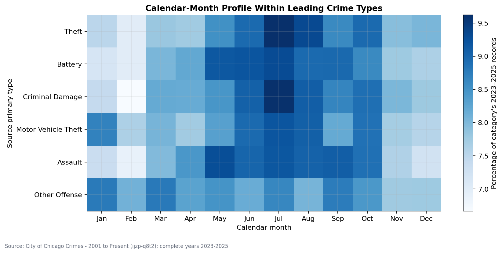
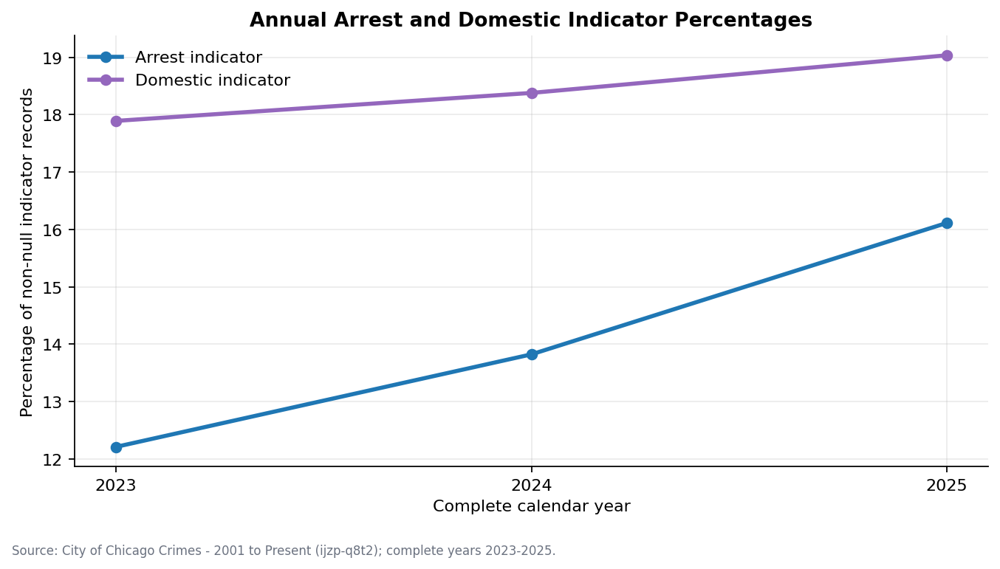
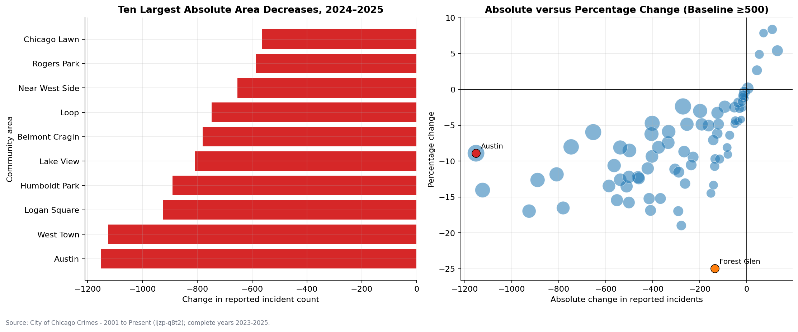

# Python Exploratory Data Analysis Report

## Scope and execution status

Milestone 7 independently analyzed `public.clean_chicago_crimes` with Pandas, NumPy, and Matplotlib. The scope contains 761,563 source-ID-distinct reported incident records dated January 1, 2023 through December 31, 2025. All three years are complete calendar years under the shared project definition.

Both notebooks were restarted and executed from beginning to end on September 26, 2026:

| Notebook | Executed code cells | Errors | Result |
|---|---:|---:|---|
| [`01_data_validation.ipynb`](../notebooks/01_data_validation.ipynb) | 9 | 0 | All 10 validation checks passed |
| [`02_exploratory_analysis.ipynb`](../notebooks/02_exploratory_analysis.ipynb) | 14 | 0 | All analyses completed and eight figures generated |

The executed runtime used Python 3.9.6, Pandas 2.3.3, NumPy 2.0.2, and Matplotlib 3.9.4. PostgreSQL connections were configured from environment variables or an optional Git-ignored `.env` file. The notebooks do not print connection URLs, users, passwords, or machine-specific paths, and every database session sets `default_transaction_read_only=on`.

## Reproduction

From the repository root:

```bash
python3 -m venv .venv
source .venv/bin/activate
python -m pip install -r requirements.txt
python scripts/build_notebooks.py
jupyter nbconvert --to notebook --execute --inplace \
  --ExecutePreprocessor.timeout=600 notebooks/01_data_validation.ipynb
jupyter nbconvert --to notebook --execute --inplace \
  --ExecutePreprocessor.timeout=600 notebooks/02_exploratory_analysis.ipynb
```

Database settings use the `POSTGRES_*` variables documented in `.env.example`. The repository-local `.venv` and `.env` remain excluded from Git.

## SQL versus Python validation

The validation notebook loaded ordered record-level fields from `clean_chicago_crimes` and calculated all Pandas totals before comparing them with the Milestone 6 views. Analytical views were used as benchmarks, not as inputs to the Python aggregations.

| Validation | Python result | SQL result | Difference |
|---|---:|---:|---:|
| Total reported incident records | 761,563 | 761,563 | 0 |
| Distinct source IDs | 761,563 | 761,563 | 0 |
| Community-area eligible records | 760,496 | 760,496 | 0 |
| First incident date | 2023-01-01 | 2023-01-01 | — |
| Last incident date | 2025-12-31 | 2025-12-31 | — |
| Community-area YoY rows | 154 | 154 | 0 |

Annual counts matched exactly for every year. Year-over-year percentages matched within an absolute tolerance of `1e-10`. Across all 154 community-area comparisons, the maximum difference was zero for prior/current counts, absolute change, percentage change, percentage eligibility, and all four ranks. Every comparison year contained all 77 official community areas.

| Year | Python reported incidents | SQL reported incidents | Python YoY | SQL YoY |
|---:|---:|---:|---:|---:|
| 2023 | 263,844 | 263,844 | — | — |
| 2024 | 259,633 | 259,633 | -1.5960% | -1.5960% |
| 2025 | 238,086 | 238,086 | -8.2990% | -8.2990% |

No SQL/Python discrepancy was observed. Forest Glen independently reproduced 545 to 409 (-136; -24.9541%), percentage-decrease rank 1 and absolute-decrease rank 46. Austin independently reproduced 12,958 to 11,806 (-1,152; -8.8903%), absolute-decrease rank 1 and percentage-decrease rank 34.

## Exploratory findings

### Yearly, monthly, and seasonal patterns

Pandas confirmed the larger citywide decline occurred from 2024 to 2025: 21,547 fewer reported incident records, or -8.2990%. Every calendar month in 2025 was below its corresponding 2024 month. This consistency across months supplements, but does not explain, the annual change.

Summer had the largest seasonal count in each year: 71,206 in 2023, 70,442 in 2024, and 65,283 in 2025. Its within-year shares were 26.9879%, 27.1314%, and 27.4199%, respectively. These are unadjusted meteorological-season counts and shares, not evidence of a weather effect.







### Day-of-week and recorded-hour patterns

Friday had the largest average per observed date at 714.26 records, followed by Saturday at 707.72; Thursday had the smallest at 681.07. Midnight was the largest recorded-hour concentration with 54,217 records (7.1192%), followed by noon with 43,582 (5.7227%). Source incident times may be estimated, so the midnight concentration may partly reflect recording conventions rather than precise event timing.



### Crime-category trends and category-specific timing

The annual category analysis reproduced the major SQL trends. Theft changed from 57,526 in 2023 to 60,558 in 2024 and 55,198 in 2025. Motor Vehicle Theft declined in both comparisons, from 29,256 to 21,712 and then 17,257. Robbery declined from 11,059 to 9,120 and then 5,817. Other Offense was one of the leading categories that remained slightly below its 2024 level but above 2023: 15,747, 17,169, and 16,851.

The within-category calendar-month analysis goes beyond citywide totals by normalizing each leading category to its own three-year volume:

| Source primary type | Largest month | Share of category records | Smallest month | Share of category records |
|---|---|---:|---|---:|
| Theft | July | 9.6213% | February | 6.9932% |
| Battery | July | 9.2993% | February | 7.0004% |
| Criminal Damage | July | 9.6015% | February | 6.6688% |
| Motor Vehicle Theft | July | 9.2034% | December | 7.5471% |
| Assault | May | 9.2810% | February | 6.8876% |
| Other Offense | March | 8.7809% | November | 7.7602% |

The profiles are pooled across 2023–2025 and are not adjusted for month length. They describe category-specific timing and are not forecasts or causal seasonal effects.





### Arrest and domestic indicators

| Year | Arrest=true | Arrest denominator | Arrest percentage | Domestic=true | Domestic denominator | Domestic percentage |
|---:|---:|---:|---:|---:|---:|---:|
| 2023 | 32,219 | 263,844 | 12.2114% | 47,206 | 263,844 | 17.8916% |
| 2024 | 35,891 | 259,633 | 13.8237% | 47,718 | 259,633 | 18.3790% |
| 2025 | 38,365 | 238,086 | 16.1139% | 45,319 | 238,086 | 19.0347% |

Both percentages increased across the three complete years, but their meanings remain limited to source indicators. The arrest percentage is not a clearance, prosecution, or conviction rate, and the domestic indicator does not measure unreported domestic violence.



### Community-area comparisons

Pandas found that 71 of 77 official community areas decreased from 2024 to 2025, six increased, and none were unchanged. The independent analysis preserved the Milestone 6 distinction between proportional and absolute change: Forest Glen had the largest eligible percentage decrease, while Austin had the largest absolute decrease.



These comparisons are reported incident counts without population, land-area, visitor, or other exposure adjustment. They must not be described as community-area crime rates.

## Visualization inventory

Eight PNG figures were regenerated by the executed exploratory notebook and visually inspected for readable titles, axis labels, chronological ordering, legends, and metric labeling:

1. `python_yearly_trend.png`
2. `python_monthly_rolling_trend.png`
3. `python_seasonal_by_year.png`
4. `python_weekday_hourly_patterns.png`
5. `python_category_yearly_trends.png`
6. `python_category_monthly_profile.png`
7. `python_arrest_domestic_trends.png`
8. `python_community_area_yoy.png`

## Limitations

- The source measures reported incidents, not all crime, and can be revised after extraction.
- Murder records represent victims according to the source, so row and case concepts differ.
- Community-area comparisons are counts, not population-normalized rates.
- Missing coordinates do not remove records from these non-map analyses.
- Incident timestamps may be estimated, limiting exact-hour interpretation.
- Calendar-month profiles are not adjusted for month length.
- Indicator, geographic, category, and temporal associations are descriptive and do not establish causation.
